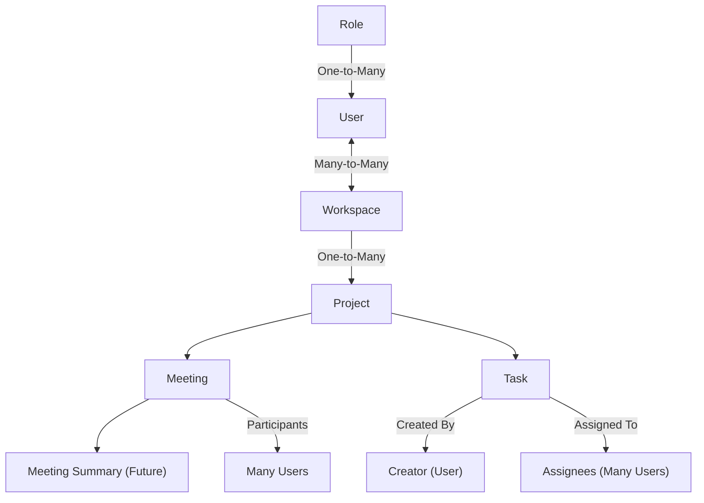

```mermaid
flowchart TD
    User <-->|Many-to-Many| Workspace
    Workspace -->|One-to-Many| Project
    Project --> Meeting
    Project --> Task
    Meeting --> MeetingSummary["Meeting Summary (Future)"]

    Role -->|One-to-Many| User
    Task -->|Created By| Creator["Creator (User)"]
    Task -->|Assigned To| Assignees["Assignees (Many Users)"]
    Meeting -->|Participants| Participants["Many Users"]
```

```
Additional relationships:
One Role → Many Users
One Task → One Creator
One Task → Many Assignees
One Meeting → Many Participants
```
